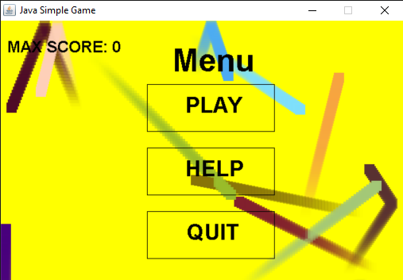
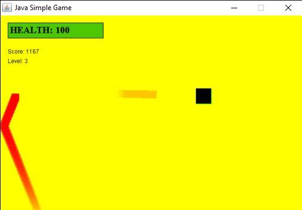

<h3 align="center">Java Simple Game</h3>

---

## 📝 Table of Contents

- [About](#about)
- [Getting Started](#getting_started)
- [Prerequisites](#prerequisites)
- [Deployment](#deployment)
- [Built Using](#built_using)
- [Authors](#authors)

## 🧐 About 

Was created to learn basics of Java language

## 🏁 Getting Started 

### 🔧 Prerequisites 

ECLIPSE and lwjgl library to handle the music

## 🚀 Deployment 

Add additional notes about how to deploy this on a live system.

## ⛏️ Built Using 

- [Java.awt] - UI
- [Java.util] - Logic
- [lwjgl] - Music

## ✍️ Authors 

- [@dimamik](https://github.com/dimamik) - Idea & Initial work

See also the list of [contributors](https://github.com/dimamik/Java_Simple_Game/contributors) who participated in this project.